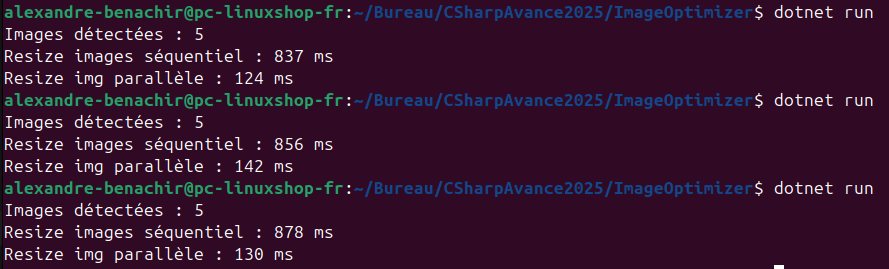

Les résultats montrent que la version parallèle du programme est plus performante que la version séquentielle. Le traitement séquentiel prend environ 850 ms pour redimensionner 5 images, la version parallèle le fait en environ 130 ms. 

Cette amélioration s’explique par l’exécution simultanée des tâches sur plusieurs cœurs du processeur, ce qui permet de réduire considérablement le temps total de traitement.